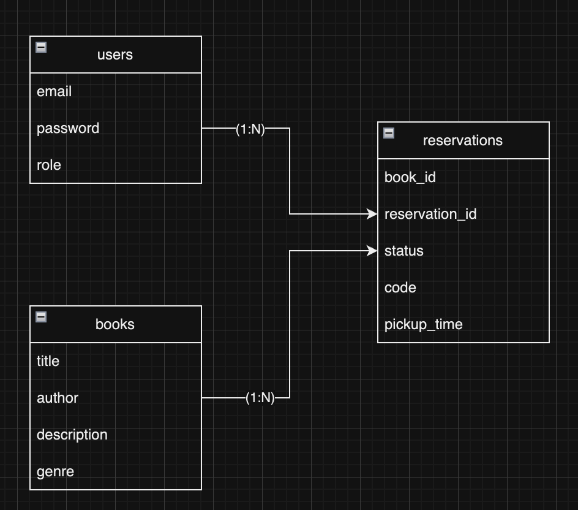

# Ilium City Public Library

[](https://https://ruby-lang.org/)
[](https://GitHub.com/Naereen/StrapDown.js/graphs/commit-activity)


The Ilium City Public Library now has a book loan system that allows its library members to
reserve and schedule a pickup time :).

## Summary

- [Ilium City Public Library](#ilium-city-public-library)
  - [Summary](#summary)
  - [Set up application](#set-up-application)
  - [How does the app work](#how-does-the-app-work)
    - [Rent process](#rent-process)
    - [Admin process](#admin-process)
  - [Technologies](#technologies)
  - [Diagram](#diagram)
  - [What should be better](#what-should-be-better)
    - [Observations](#observations)

## Set up application

To run the application you must have [ruby 3.2.2](https://www.ruby-lang.org/pt/documentation/installation/) and [mysql](https://dev.mysql.com/doc/mysql-installation-excerpt/5.7/en/). After that, follow the steps below

1. Clone application using HTTPS, for example
```
$ git clone https://github.com/vvenancio297/library.git
```

2. Go to theproject directory
```
$ cd library
```

3. Install bundler, as through it we will install the dependencies defined in the Gemfile
```
$ gem install bundler -v 2.4.10
```

4. Now we just need to install the dependencies by running the command
```
$ bundle install
```

5. Finally, as a last step, we just need to define the environment variables file that must be in the file `.env`:
```
$ cp .env.sample .env
```

6. Create your local database running
```
$  rails db:drop db:create db:migrate db:seed
```
_it will also create a new admin user for you to log in_

7. Start the server
```
$ rails server
```

Enjoy the application

## How does the app work

Here is a click glimpse in how the app works

### Rent process

The idea is that members can rent books through this application. To do this, they must register themselfs (by default every registered user will be a new member).
After registering, you will be redirected to the book list page, where you can make a reservation through a link. However, when the reservation is made, the system will generate the reservation number that will be necessary to inform when returning and collecting the book.

You may be wondering what should you do if you forget your reservation number. It's simply, just access the reservations page which will display all the reservations you have made.

### Admin process

When you're an admin, your able to change the reservation status as well reserve books, just like a member. However, there's one more difference, in the reservations page you'll see all the reservations made in the app, not only yours.

## Technologies

- ruby 3.2.2
- rails 7
- mysql

## Diagram

This is the database diagram.

- A member/admin can have many registrations
- A book may have many registratios also, but only once at time



## What should be better

Thinking about more development time, I listed some topics where it would be worth making some improvements. Are they:

- add user management, making it easier to assign new admins
- add a reservation queue, so the admin must always approve reservations in an orderly manner
- use any front-end frameworks 
- implement user account recovery
- implement robust authorization
- reservation pagination and books pagination
- add more reservation filters in the reservations page
- add reservation validation based on the pickup time
- docker and docker-compose
- increase code coverage
- retry to generate reseravation code if an error happens
- use view helpers to avoid business rules in view
- add soft delete process to books
- if the book's reservation is returned, lock its updating in the backend side
- use [state_machines](https://github.com/state-machines/state_machines) gem state_machines to manage reservation statuses
- add pull request templates


### Observations

I'm sorry about not merging the first PRs with the squash strategy, I just forgot about it.